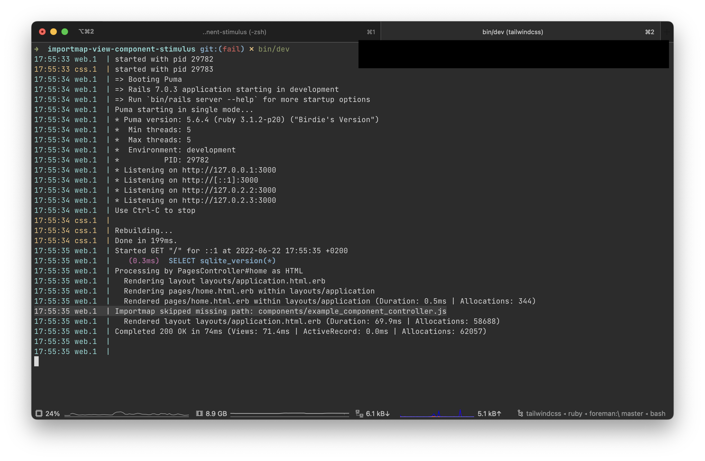

# Rails 7 + View Component + importmap-rails + Stimulus example

This is a test app to replicate the setup that allows you to use importmaps-backed vanilla `rails new` Rails 7 app with the View Components generated with `--stimulus` flag.

The `main` branch contains a workaround that allows both default Stimulus controllers, and the Stimulus controllers generated by View Component to co-exist.

Run the app locally:

- clone this repo
- bundle && dev/bin
- point the browser to `localhost:3000`

The `fail` branch demonstrates that the obvious way to pin component's Stimulus controllers in `importmap.rb` and register them in `manifest.js` doesn't work and leads to the _"Importmap skipped missing path"_ error.

## Current workaround

Currently, in order for the `components/example_component_controller.js` to work, the `components` folder **needs to be nested**.
If we place `components` inside `app/frontend` and add the following configuration, controllers work as expected:

```rb
# importmap.rb

pin 'application', preload: true
pin '@hotwired/turbo-rails', to: 'turbo.min.js', preload: true
pin '@hotwired/stimulus', to: 'stimulus.min.js', preload: true
pin '@hotwired/stimulus-loading', to: 'stimulus-loading.js', preload: true
pin_all_from 'app/javascript/controllers', under: 'controllers'
# New configuration
pin_all_from 'app/frontend/components', under: 'controllers', to: 'components'
```

```rb
# application.rb

config.eager_load_paths << Rails.root.join('app/frontend/components')
config.importmap.cache_sweepers << Rails.root.join('app/frontend')
config.assets.paths << Rails.root.join('app/frontend')
config.view_component.view_component_path = 'app/frontend/components'
```

```js
// manifest.js

//= link_tree ../images
//= link_directory ../stylesheets .css
//= link_tree ../../javascript .js
//= link_tree ../builds
// New configuration
//= link_tree ../../frontend/components .js
```


This workaround is not ideal, as it requires us messing with the Rails' `eager_load_paths`, even though it should not be the case for folders under `app`.

## Without the workaround

Here's the same app's configuration, but without the workaround (components are under `app/components`). There are no changes to `application.rb` and the controllers are loaded like so:

```rb
# importmap.rb

pin 'application', preload: true
pin '@hotwired/turbo-rails', to: 'turbo.min.js', preload: true
pin '@hotwired/stimulus', to: 'stimulus.min.js', preload: true
pin '@hotwired/stimulus-loading', to: 'stimulus-loading.js', preload: true
pin_all_from 'app/javascript/controllers', under: 'controllers'
# New configuration
pin_all_from 'app/components', under: 'components'
```

```js
// manifest.js

//= link_tree ../images
//= link_directory ../stylesheets .css
//= link_tree ../../javascript .js
//= link_tree ../../components .js
//= link_tree ../builds
```

```js
// app/javascript/controllers/index.js

// Import and register all your controllers from the importmap under controllers/*

import { application } from "controllers/application";

// Eager load all controllers defined in the import map under controllers/**/*_controller
import { eagerLoadControllersFrom } from "@hotwired/stimulus-loading";
eagerLoadControllersFrom("controllers", application);

// Added line
eagerLoadControllersFrom("components", application);
```

As you can see, in this case the View Component's Stimulus controllers are not loaded.



